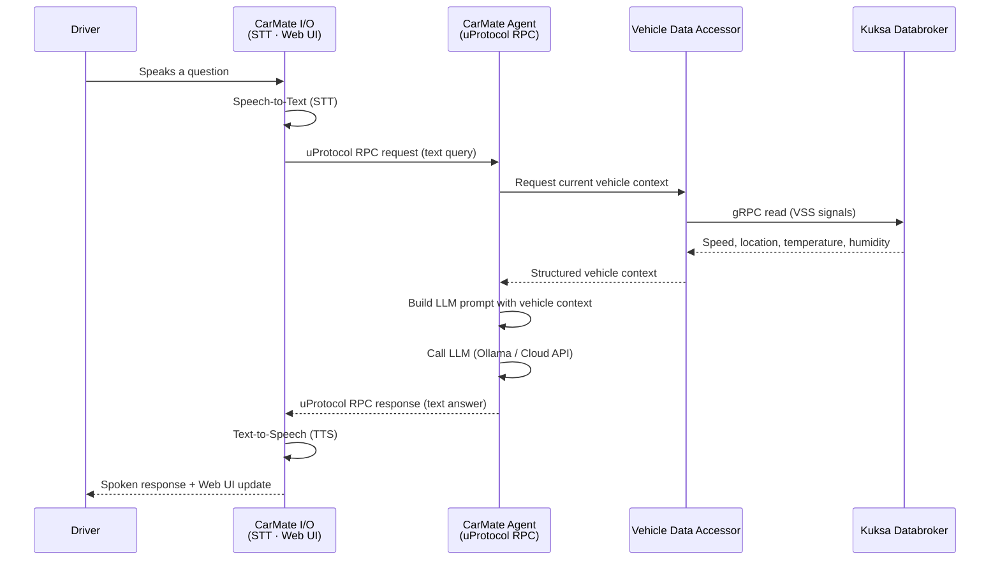

# Architecture

## System Overview


CarMate spans three connected nodes. Each node has a distinct role: hardware sensing, software-defined vehicle processing, and simulation/visualization.

## Node Breakdown

### MCU Node

| Property | Detail |
| --- | --- |
| **Role** | Hardware sensor acquisition and MCU-to-cloud telemetry publishing |
| **Key Software** | ThreadX RTOS, Rust firmware (`threadx-app`) |
| **Key Hardware** | Azure IoT Dev Kit (MXChip AZ3166) |
| **Connectivity** | Wi-Fi → MQTT to the Compute Node |
| **Published Signals** | Temperature (`mcu/temperature`) |

The MCU node runs a ThreadX-based Rust application that reads onboard sensors and publishes environmental data to the MQTT broker on the Compute Node over Wi-Fi.

### Compute Node

| Property | Detail |
| --- | --- |
| **Role** | Central SDV processing node: signal brokering, AI reasoning, and driver interaction |
| **Key Software** | Docker Compose stack (8 containerized services) |
| **Key Hardware** | Linux machine (x86_64 or ARM64) |
| **Connectivity** | Ethernet to HPC Node, Wi-Fi to MCU Node |

The Compute Node hosts all containerized SDV services. It is the core of the CarMate blueprint and the minimum required node to run the system.

### HPC Node

| Property | Detail |
| --- | --- |
| **Role** | Simulation environment and instrument cluster visualization |
| **Key Software** | CARLA 0.9.16, instrument display application |
| **Key Hardware** | Windows machine (dedicated GPU recommended) |
| **Connectivity** | Ethernet → MQTT to the Compute Node; uProtocol/Zenoh to CarMate I/O |
| **Published Signals** | Speed, Latitude, Longitude, Altitude, Road Wetness |

The HPC Node runs the CARLA driving simulator, which generates realistic vehicle dynamics. A CARLA-to-MQTT bridge on the Compute Node reads this data and forwards it as VSS-aligned signals.

## Data Flow

The following describes the end-to-end signal path from sensor hardware through the SDV stack to the driver-facing AI:

```
MCU Sensors → Wi-Fi MQTT → MQTT Broker
CARLA Simulator → Ethernet MQTT → MQTT Broker
                                       │
                              MQTT-Kuksa Provider
                                       │
                                  Zenoh Router
                                       │
                             Eclipse Kuksa Databroker
                             (VSS-aligned signal store)
                                       │
                           Vehicle Data Accessor (gRPC)
                                       │
                              CarMate Agent (LLM)
                                       │
                    ┌──────────────────┴──────────────────┐
              CarMate I/O                          Vehicle systems
          (STT · TTS · Web UI)                  (ambient lighting, etc.)
                    │
                 Driver
```

All vehicle signals flowing through the Compute Node are normalized to [COVESA VSS](https://covesa.github.io/vehicle_signal_specification/) paths inside the Kuksa Databroker:

| MQTT Topic | VSS Signal Path | Unit |
| --- | --- | --- |
| `carla/vehicle/speed` | `Vehicle.Speed` | km/h |
| `carla/vehicle/lat` | `Vehicle.CurrentLocation.Latitude` | ° |
| `carla/vehicle/lon` | `Vehicle.CurrentLocation.Longitude` | ° |
| `carla/vehicle/alt` | `Vehicle.CurrentLocation.Altitude` | m |
| `carla/vehicle/wetness` | `Vehicle.Exterior.Humidity` | % |
| `mcu/temperature` | `Vehicle.Cabin.HVAC.AmbientAirTemperature` | °C |

## Component Interaction

| Component | Node | Function | Technology |
| --- | --- | --- | --- |
| Eclipse AutoWRX SDV Runtime | Compute | Middleware orchestration and service lifecycle management | Docker, AutoWRX |
| Eclipse Mosquitto | Compute | Central MQTT message broker for all sensor topics | Eclipse Mosquitto 2.0 |
| Eclipse Zenoh Router | Compute | uProtocol transport layer; connects services via pub/sub and RPC | Eclipse Zenoh |
| MQTT-Kuksa Provider | Compute | Subscribes to all MQTT sensor topics and forwards values to Kuksa via Zenoh | Python, paho-mqtt, kuksa-client |
| CARLA-Kuksa Provider | Compute | Bridges CARLA simulation (or mock data) to MQTT topics | Python, carla, paho-mqtt |
| Eclipse Kuksa Databroker | Compute | VSS-based central vehicle signal store; provides gRPC API | Eclipse Kuksa |
| Vehicle Data Accessor | Compute | Reads VSS signals from Kuksa Databroker and exposes them to the CarMate Agent | Python, kuksa-client |
| CarMate Agent | Compute | Receives driver queries via uProtocol RPC, queries vehicle context, calls LLM, and returns responses | Python, uProtocol, Ollama/OpenAI/Gemini |
| CarMate I/O | Compute | Flask web application providing the driver Web UI, STT/TTS pipeline, and cluster display | Python, Flask, SpeechRecognition |

## Driver Interaction Sequence

The following sequence diagram shows a complete driver interaction — from a spoken query to an AI-generated spoken response:



## Communication Protocols

| Protocol | Usage in CarMate |
| --- | --- |
| **MQTT** | Sensor data ingestion from CARLA and MCU to the Compute Node |
| **Eclipse Zenoh** | Internal uProtocol transport between Compute Node services |
| **uProtocol (RPC)** | CarMate I/O → CarMate Agent request/response calls |
| **gRPC** | Vehicle Data Accessor → Kuksa Databroker signal reads |
| **HTTP / REST** | CarMate I/O Flask web application for the driver browser UI |
| **Wi-Fi** | MCU Node to Compute Node MQTT communication |
| **Ethernet** | HPC Node (CARLA) to Compute Node MQTT communication |
