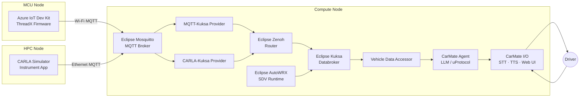

# CarMate — AI-Powered In-Vehicle Companion

## Overview

|                          |                                                                                                                                                                                                                                     |
| ------------------------ | ----------------------------------------------------------------------------------------------------------------------------------------------------------------------------------------------------------------------------------- |
| **Short Summary**        | CarMate is an AI-powered in-vehicle companion blueprint for Software Defined Vehicle (SDV) architectures. It enhances driver well-being, safety, and interaction by combining real-time vehicle data, conversational AI, and safe human-machine interfaces. |
| **What is in the showcase** | Real-time vehicle telemetry via VSS-aligned signals, Speech-to-Text (STT) and Text-to-Speech (TTS) processing, LLM-driven conversational AI, cluster display and Web UI, MCU hardware integration (optional)                      |
| **SDV Projects Involved** | [Eclipse Kuksa](https://eclipse-kuksa.github.io/kuksa-website/), [Eclipse Zenoh](https://zenoh.io/), [Eclipse AutoWRX](https://github.com/eclipse-autowrx)                                                                        |
| **Other Technologies**   | [CARLA Simulator](https://carla.org/), [COVESA VSS](https://covesa.github.io/vehicle_signal_specification/), [Eclipse Mosquitto](https://mosquitto.org/), [Docker](https://www.docker.com/), [Ollama](https://ollama.com/)         |
| **Target Hardware**      | Linux compute node (Docker host), Windows machine (CARLA simulator), Azure IoT Dev Kit / MCU node (optional)                                                                                                                        |
| **Source Repository**    | [eclipse-sdv-blueprints/carmate](https://github.com/eclipse-sdv-blueprints/carmate)                                                                                                                                                 |
| **Architecture Overview** |                                                                                                                                                                              |

## Blueprint Purpose

CarMate demonstrates an end-to-end SDV architecture for an AI-powered in-vehicle companion. It connects vehicle sensor data, simulation, and AI-driven conversational logic into a reproducible reference architecture built entirely from open-source SDV components.

The blueprint targets long-distance drivers, such as truck drivers and commuters, and addresses driver fatigue, loneliness, and situational awareness through intelligent, voice-driven in-vehicle interaction.

Key goals:

- Provide a reusable and extensible SDV blueprint based on open-source components
- Align all vehicle data with [COVESA Vehicle Signal Specification (VSS)](https://covesa.github.io/vehicle_signal_specification/) semantics
- Demonstrate bidirectional interaction between driver, AI, and vehicle systems
- Support both hardware-in-the-loop (CARLA + MCU) and fully simulated (mock) deployments

## Use Cases

CarMate focuses on a driver companion scenario and supports the following interactions:

| Use Case | Description |
| --- | --- |
| **Voice interaction** | Captures driver voice input and converts it into structured commands via speech-to-text |
| **Conversational AI** | Enables the AI companion to respond socially, reducing driver loneliness |
| **Vehicle context awareness** | Maps telemetry (speed, altitude, temperature, humidity) into VSS signals for AI consumption |
| **Environmental insights** | Provides contextual driving information such as weather and road condition data |
| **Vehicle control** | Controls selected vehicle features such as ambient lighting based on AI decisions |
| **Data visualization** | Displays key vehicle data and AI-generated insights on the cluster display and Web UI |
| **Bidirectional interaction** | Supports full round-trips: driver input → AI reasoning → vehicle feedback |

## SDV Technologies

The diagram below shows how the core Eclipse SDV components interact within CarMate:

## Attribution

CarMate is built upon and evolved from the original hackathon project **[ArBytesMoral](https://github.com/Eclipse-SDV-Hackathon-Chapter-Three/ArBytesMoral/tree/main)**, developed during the Eclipse SDV Hackathon Chapter Three. The following foundational contributions are gratefully acknowledged:

- **In-Vehicle AI Companion Concept** — The original vision for an interactive, driver-focused AI companion designed to enhance well-being, mitigate driver fatigue, and manage in-cabin interactions.
- **Initial Hardware & Simulation Pipeline** — The end-to-end telemetry architecture connecting MCU sensor hardware, CARLA simulator environments, and Kuksa-based VSS signal processing.
- **Core Agent Interaction Flow** — The basic architecture for integrating STT, TTS, and LLM-driven conversational logic with vehicle signal loops.

Building upon that foundational work, this project introduced the following major updates:

- **Containerization** — Migrated from Podman to Docker
- **Language migration** — Rebuilt the core codebase from Rust to Python
- **SDV runtime** — Integrated Eclipse AutoWRX as a primary middleware layer
- **Flexible LLM support** — Added Ollama (local) alongside cloud-based models (OpenAI, Gemini, Grok, Groq)
- **Enhanced visuals** — Redesigned cluster display and Web UI
- **Mock data fallback** — Blueprint runs and can be evaluated without a CARLA server

## Continue Reading

- [Architecture](./architecture) — Detailed node breakdown, data flow, and component interaction
- [Getting Started](./getting-started) — Prerequisites, quick start, and step-by-step setup guide
- [Components](./components) — Per-component reference for every service in the Docker Compose stack
